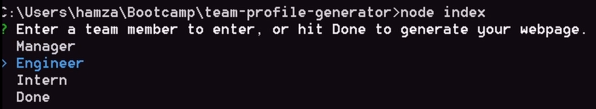
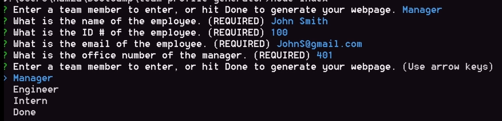
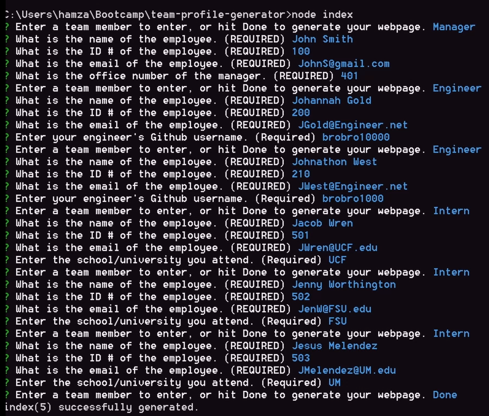
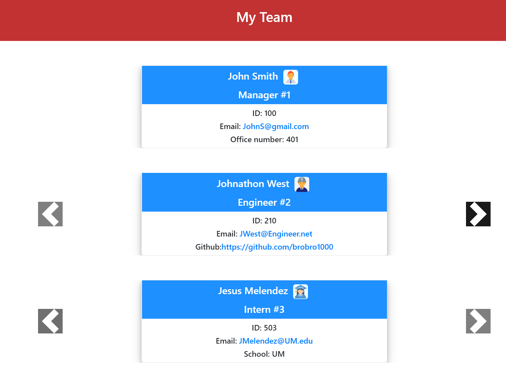
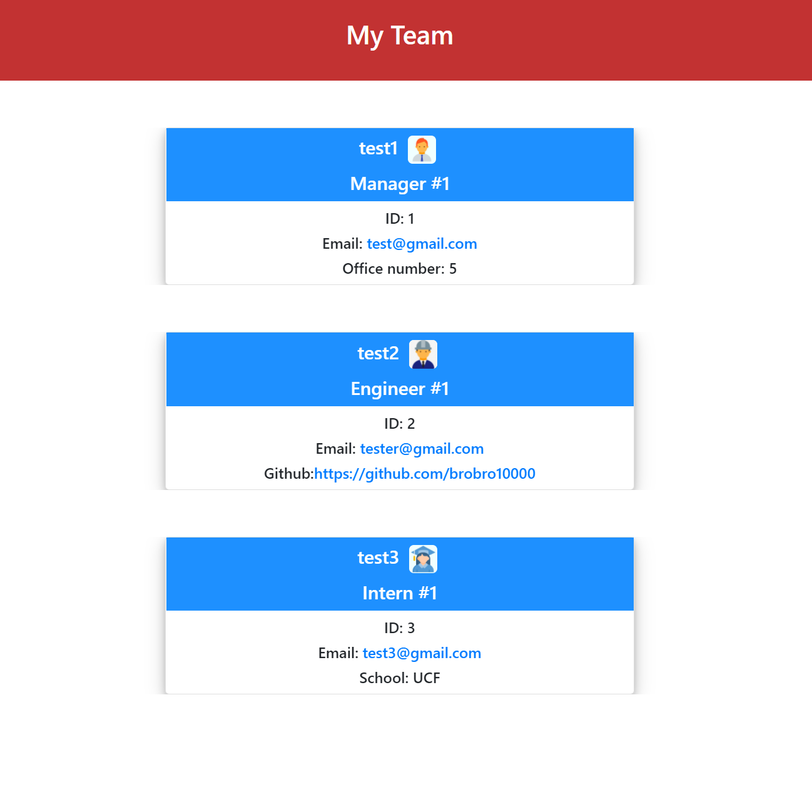
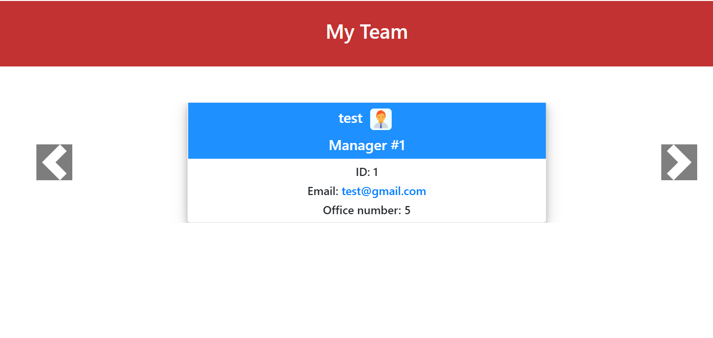
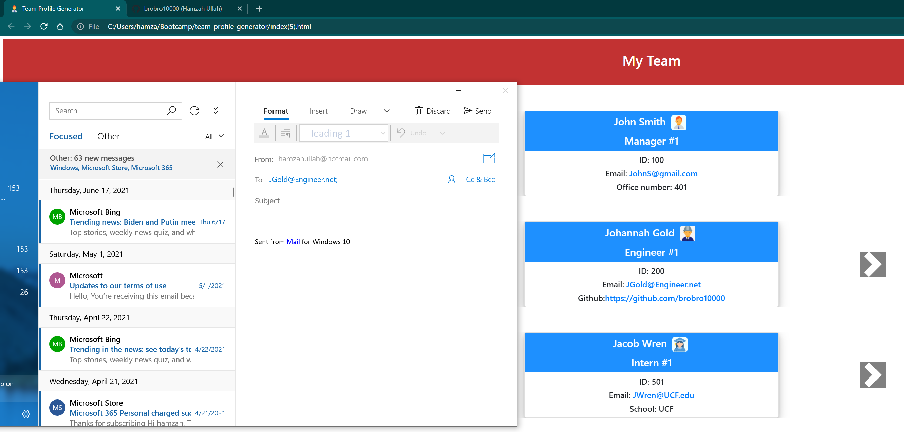
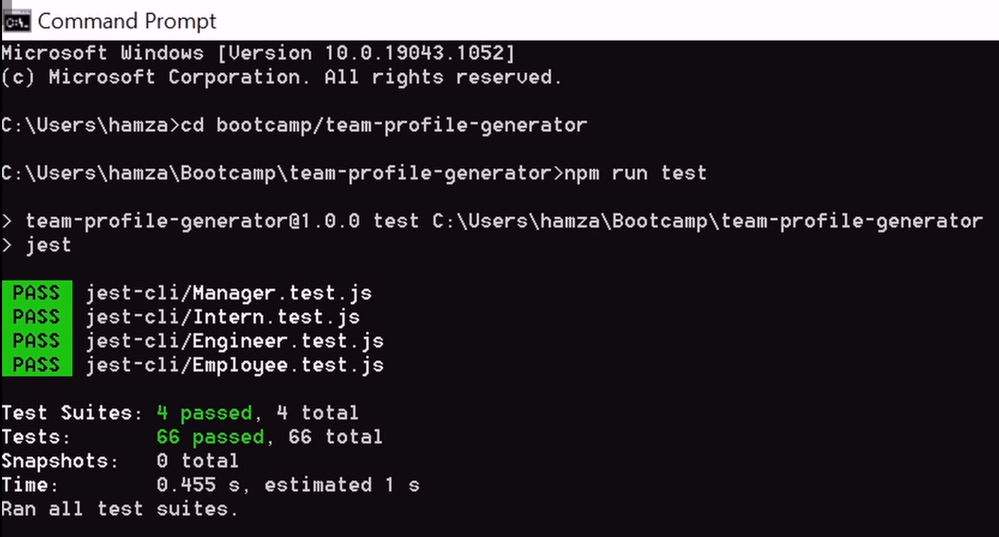
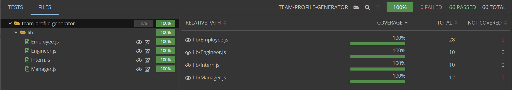

# The Team Profile Generator

## **The Team Profile Generator**
This program allows you to create a team profile of your team, allowing the user to quickly generate a roster of all the people they work with. By responding to the prompts and carefully following instructions, they can generate a clean HTML profile page with their team information to quickly send them an email, visit their github or learn any other information they require

- After the user enters 'node index', they answer a series of questions to fill in the HTML cards with the data. The node package used to generate the structure is the [inquirer](https://www.npmjs.com/package/inquirer) package.

- They can start by entering a manager, but can also enter an engineer or intern first if they wish, but the page will always render in the order of Manager, Engineer and Intern. After the user enters the managers name, id, email and office number, they are prompted by the initial message again. 

- Once the user has entered their entire team, they can select 'Done' and it will return the name of the file (in this case index(5)) and that the HTML page has successfully generated. The information for engineer includes a github username, and for the intern, it would be their university.  

- The page generated is presented as a carousel style, allowing the user to slide through their team information. There is a number to represent which Manager, Engineer or Intern they are currently looking at. 

- The carousel buttons are dynamically generated with logic to determine if more then a single type of that employee exist, if so, the buttons appear, otherwise, the buttons do not appear.

- The user may also generate a single type of employee or even two types! The employees will always render with the same hierarchy of Manager, Engineer then Intern. 

- When the user selects the email of the employee, their default mail app opens with the email in the 'TO' section. Also, on click of the github link, it is opened in a seperate tab as the requirements specify.  

- Using test driven development, we were able to use the employee class to inherit properties when we extended it towards the manager, engineer and intern class. Double checking of course that each one of the classes that extended from the employee class, also had passing test. 

- By using the [Wallabyjs](https://wallabyjs.com/) extension, we were able to quickly write and verify that the testing through [Jest](https://jestjs.io/) was accurately covering the entirety of the code to ensure that any input the user writes, is checked for and prevented by throwing errors. 

# Why it Matters?
Using test driven development is essential to writing virtually unbreakable code. Writing test driven code throughout a project, developers can avoid situations where edge cases may occur that the user may encounter through day to day use. In a simple program such as the team profile generator it is easy to fix, but in a larger scale project with thousands of lines of code and a multitude of classes intricately interacting with each other, test driven development is key to ensure the best quality code is written for the best user experience in the end product.

Watch my Team Profile Generator in action! The image below links to a Youtube video of the demonstration of the team profile generator, or [Click Here](https://youtu.be/rct3pW8InJc)!

## 
We Hope to see you there!
 ##
